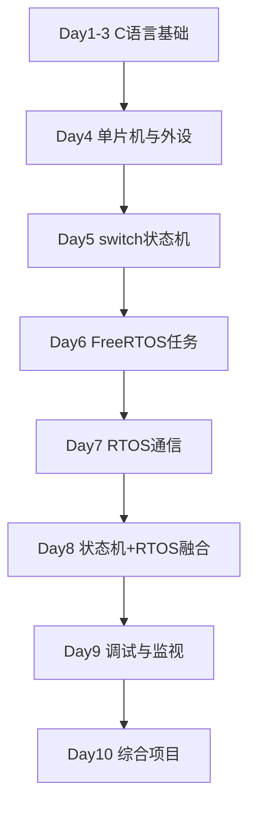

# Embedded C + FreeRTOS Learning Roadmap

10 天渐进式嵌入式 C 语言 + FreeRTOS 学习计划。

## 学习目标

1. 掌握 C 语言基础，能读写嵌入式工程代码
2. 理解 STM32CubeMX + HAL 开发方式
3. 理解 VS Code + PlatformIO 的 ESP32-S3 开发方式
4. 学会 FreeRTOS 任务管理 + switch 状态机控制程序开发
5. 学会串口调试、任务监视、版本管理

## 知识路线图



## 课程目录

| Day | 主题 | 状态 |
|---|---|---|
| 1 | C语言骨架：变量、类型、判断、循环 | Done |
| 2 | 函数、数组、指针 | - |
| 3 | 结构体、枚举、模块化 | - |
| 4 | GPIO、串口、延时 | - |
| 5 | switch 状态机 | - |
| 6 | FreeRTOS 任务基础 | - |
| 7 | 队列、信号量、同步 | - |
| 8 | 状态机 + FreeRTOS 融合 | - |
| 9 | 调试、监视、GitLens | - |
| 10 | 综合项目与公开整理 | - |

## 目录结构

```
├── README.md
├── docs/          # 每日课程内容
├── examples/      # 练习代码
└── notes/         # 每日学习总结
```

## 工具链

- VS Code + PlatformIO (ESP32-S3)
- STM32CubeMX + HAL
- CLion（串口/任务监视）
- Git + GitLens
