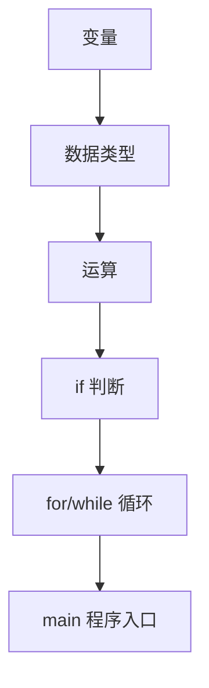

# Day 01 - C语言骨架

## 学习目标

- 理解变量、类型、运算、判断、循环
- 理解"程序 = 数据 + 规则 + 重复执行"
- 建立"嵌入式程序本质上还是 C 程序"的认知

## 核心知识点

### 数据类型

| 类型 | 含义 | 例子 |
|---|---|---|
| `int` | 整数 | `0`, `1`, `100` |
| `char` | 单个字符 | `'A'`, `'b'` |
| `float` | 小数 | `3.14`, `2.5` |

### 控制流

- `if / else`：条件判断
- `for`：次数型循环
- `while (1)`：嵌入式持续运行结构

### 程序结构

```c
#include <stdio.h>

int main()
{
    // 程序逻辑
    return 0;
}
```

## 知识地图



## 嵌入式映射

| C 语言概念 | STM32 HAL 对应 | ESP32 对应 |
|---|---|---|
| 变量 | LED 状态、按键值 | 引脚状态、计数器 |
| `if` | 判断按键输入 | 判断串口命令 |
| `for/while` | 主循环 `while(1)` | `loop()` |
| `main()` | CubeMX 生成的入口 | PlatformIO 入口 |

## 常见错误

- `=` vs `==`：赋值和判断不要搞混
- `return 0;` 放在循环里会立刻退出程序
- 循环变量和状态变量不要混用
- `printf` 格式字符串必须用双引号

## 练习题

1. 温度判断（if/else）
2. 打印 0~4（for 循环）
3. LED 闪烁模拟（状态切换）
4. 模式循环切换（状态归零）
